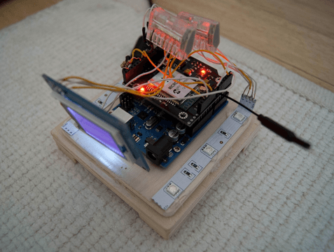

Remembrall war mein zweites Projekt mit dem Arduino Board. Zuerst hatte ich mit einem Freund zusammen eine Art Ambilight zusammengebaut, welches auch mit dem Computermonitor verwendet werden kann.

## Motivation

In diesem Projekt wollte ich das Wifi-Shield ausprobieren und da ich als Stundent ständig wechselnde Stundenpläne hatte, musste ich regelmäßig meinen Wecker anpassen. Die Stundenpläne trug ich ohnehin bereits in meinen Google Kalender ein. Daher fand ich, wäre es doch schön, wenn mein Wecker sich immer an meinen online gepflegten Stundenplan anpassen würde. Auch untertags hätte ich mir des öfteren mal einen Hinweis gewünscht, ob ich gleich in einer Vorlesung sitzen sollte.

## Ergebnis

Die letzte Version des Weckers hatte eine eingebaute Uhr, einen Alarm, eine Wetteranzeige und einen Demo-Modus. In jedem Modus fängt der Wecker eine konfigurierbare Zeit vor einem Termin an zu leuchten. Die Intensität des Leuchtens nimmt dabei bis zum Start des Termins zu. Die Modi können durch einen kurzen Druck auf den Wecker gewechselt werden. Klingelt der Wecker, kann dieser ebenfalls durch einen Druck wieder zum Schweigen gebracht werden.

<figure style="max-width:320px;float:left;margin-right:2em">

<figcaption>Der Wecker ohne Deckel mit bereits angeschlossener Peripherie.</figcaption>
</figure>

<figure style="max-width:320px;float:right;margin-left:2em">

<figcaption>Dieses Video zeigt den Wecker und all seine Funktionen in Aktion. Zum Abspielen einfach auf das Bild oder <a href="https://www.youtube.com/watch?v=iJd8Pvlnlzw">hier klicken</a>.</figcaption>
</figure>

